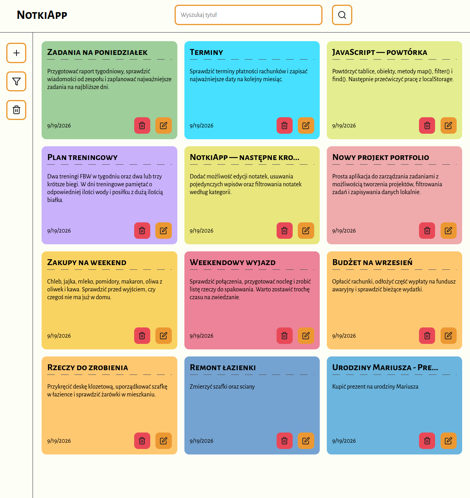

# NotkiApp 📓

Nowoczesna aplikacja do zapisywania notatek. Umożliwia teorzenie kolorowych sticky notes, tworzenie kategorii oraz zarządzanie i filtrowanie notatek.

Ten projekt zaprojektowałem i zrobiłem sam aby bardziej opanować sterowanie stroną za pomocą js, oraz działanie z localstorage i tablicami obiektów.



---

## 🔗 Live demo

[Live Demo Link](https://mszymus.github.io/NotkiApp/)

---

## 🛠 Technologie

- HTML5
- CSS3
- JavaScript (ES6+)
- Git i Github
- Local Storage API
- Font Awesome
- Nazewnictwo klas BEM
- Tablice obiektów
- Responsive Web Design

---

## ✨ Funkcje

- Zarządzanie Notatkami
  - tworzenie notatek
  - edycja notatek
  - usuwanie wszystkich i pojedyńczych notatek
  - przypisywanie kategorii do notatek
  - wiele zabezpieczeń przed przypadkowym kliknięciem (UX friendly)
- Zarządzanie Kategoriami
  - tworzenie kategorii
  - personalizacja kolorów kategorii
  - usuwanie kategorii
  - zabezpieczenia przed przypadkowym usunięciem kategorii i notatek
- Filtrowanie
  - filtrowanie po tytule (pasek wyszukiwania)
  - filtrowanie po dacie utworzenia notatki
  - filtrowanie po kategorii notatek
- UI / UX
  - responsywny layout
  - zapisywanie danych w localstorage
  - filtry i przyciski (mobile friendly)

---

## ▶️ Jak uruchomić lokalnIE

```bash
# sklonuj repozytorium
git clone https://github.com/mszymus/NotkiApp

# otwórz
cd NotkiApp
# otwórz index.html w przeglądarce  (lub użyj rozszerzenia live server w vs code)
```

## 💡 Czego się nauczyłem

Ten projekt nauczył mnie bardzo dużo w obsługiwaniu strony i aplikacji webowych za pomocą js:

- manipulacja DOM
- delegacja zdarzeń
- dynamicznie tworzone elementy
- metody tablic (find, filter, forEach)
- renderowanie elemntów
- localStorage z JSON.stringify() i JSON.parse()
- responsywny i spójny design (kolory, czcionki, mobile-first)
- nazewnictwo klas BEM
- Obsługa i reaguarne commitowanie za pomocą git'a

## ➕ Przyszłe poprawki i ulepszenia

możliwe następne ulepszenia:

- przy usuwaniu kategorii możliwość przypisania do notatek innej ategorii
- sortowanie drag and drop
- układanie kafelków notatek na wzór pinteresta
- przełącznik rybu na ciemny
- wersja React

## 👤 Autor

MateuszS • https://github.com/mszymus

Kontakt: mateusz.szymus7@gmail.com
